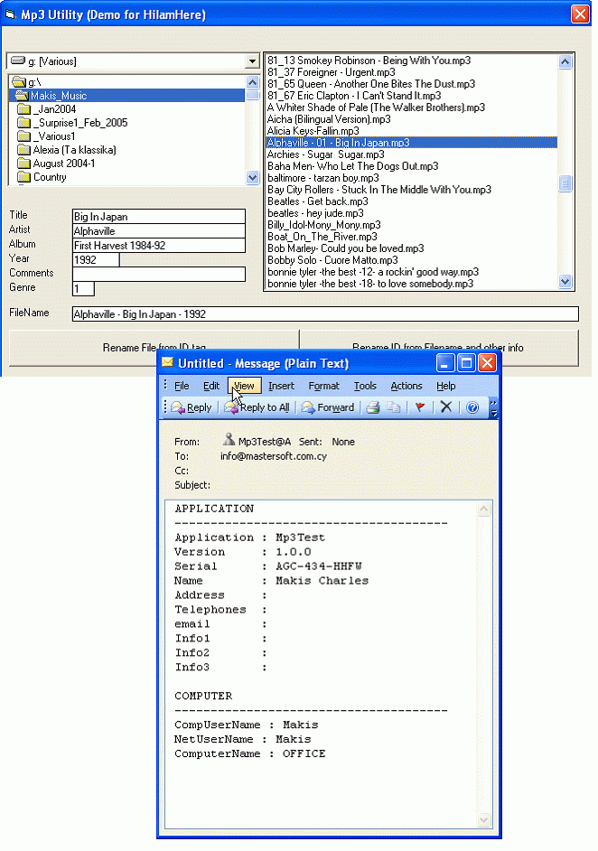



## HiIamHere\.ocx  \(Your software reports back to you\)

### Description

I wanted my software to "report back" to me, now and then, about their whereabouts.

So here it’s an activex control that asynchronously and unobtrusively sends me back information.

It is fully parametric and I have it set to report back the first week, first month and then every 3 months. It calls the API directly instead of the winsock control and never gives an error no matter what! It just works on the background and waits the right moment. Then it can try on predefined periods to contact the internet and send the info. In this way I know how many copies are out there, their serials etc. To demonstrate the control I have included a very simple MP3 utility that I wrote to help me clean my mp3s (Don’t burn me for this ). Unlike other software it can also take the ID Tag information and use it to rename the filename of the song (instead of 44xx23.mp3 etc ). Some of the code ofcourse comes from the great Planet-Source!!

Let me know what you think because there is also the ETHICAL side of this control and I would like to know your opinion about it.

I mean if it’s ethical to have your software sending back info about their users without their knowledge.
 
### More Info
 

             |
---                |---
**Submitted On**   |2005-02-13 15:55:38
**By**             |[Makis Charalambous](https://github.com/Planet-Source-Code/PSCIndex/blob/master/ByAuthor/makis-charalambous.md)
**Level**          |Intermediate
**User Rating**    |5.0 (15 globes from 3 users)
**Compatibility**  |VB 6\.0
**Category**       |[Custom Controls/ Forms/  Menus](https://github.com/Planet-Source-Code/PSCIndex/blob/master/ByCategory/custom-controls-forms-menus__1-4.md)
**World**          |[Visual Basic](https://github.com/Planet-Source-Code/PSCIndex/blob/master/ByWorld/visual-basic.md)
**Archive File**   |[HiIamHere\_1852832142005\.zip](https://github.com/Planet-Source-Code/makis-charalambous-hiiamhere-ocx-your-software-reports-back-to-you__1-58904/archive/master.zip)

